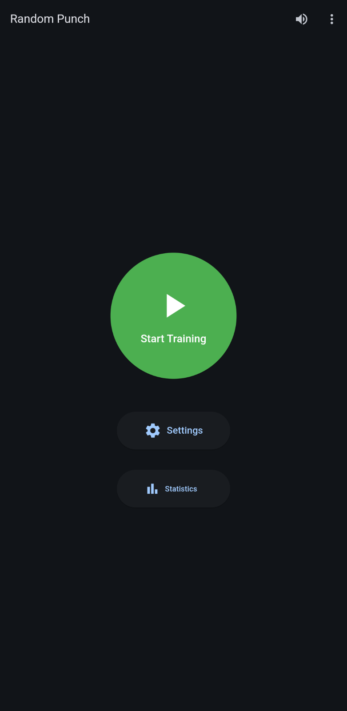
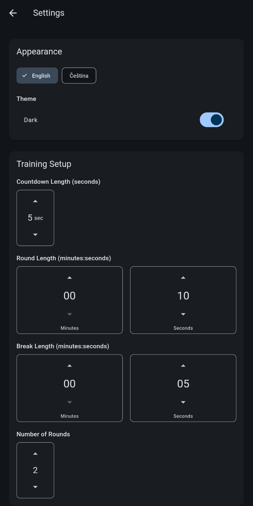
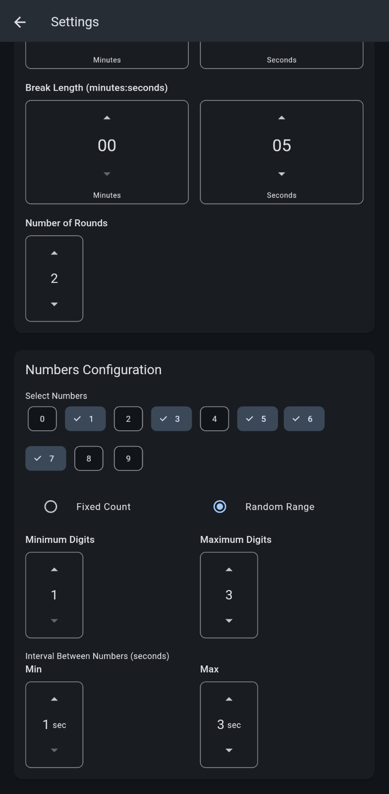
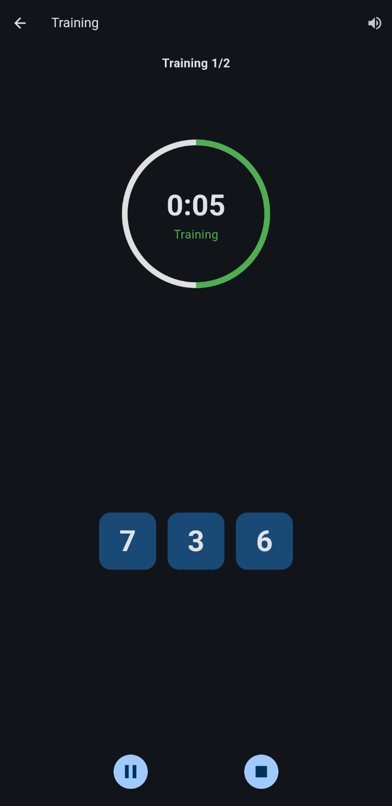
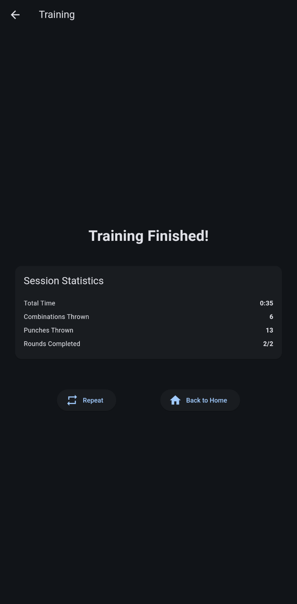
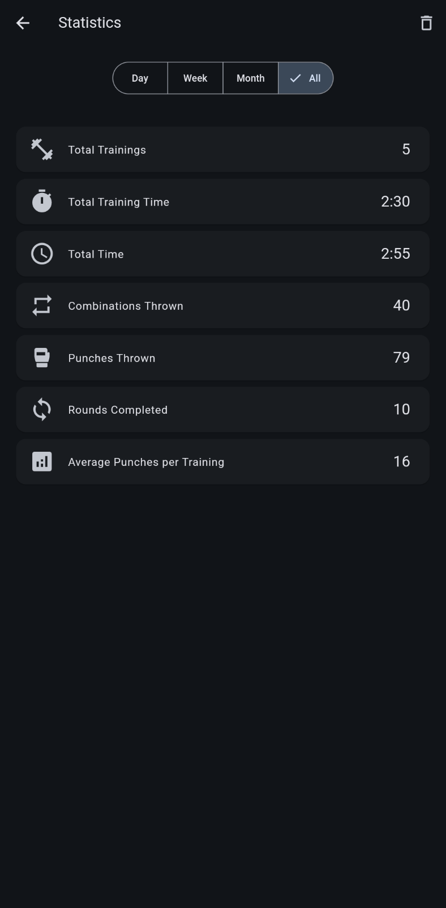

# Random Punch

[🇨🇿 Česká verze](README_CS.md)

A training app for MMA/boxing that helps athletes practice techniques and combinations through random number displays.

## Quick Start Guide

1. **Start Training**: Click the "Start Training" button on the home screen
2. **Get Ready**: A countdown will begin before your training starts
3. **Training**: Follow the numbers displayed and perform corresponding techniques
4. **Breaks**: Rest between rounds when indicated

## Settings

### Time Settings
- **Round Length**: Set the duration of each training round
- **Break Length**: Set the duration of rest periods between rounds
- **Countdown Length**: Set the initial countdown duration before training starts
- **Number of Rounds**: Set how many rounds you want to train

### Number Settings
- **Numbers to Show**: Choose between fixed count or random range
  - **Fixed Count**: Always shows the same number of digits
  - **Random Range**: Shows a varying number of digits within your set range
- **Interval Between Numbers**: Set how quickly new numbers appear
  - Set minimum and maximum intervals for more variety

### Language
- Switch between English and Czech using the language selector

### Statistics
- Track your training progress with detailed statistics
- View total training time, breaks, and rounds completed
- Monitor combinations and punches thrown
- Filter statistics by day, week, month, or all-time

### Audio Features
- Voice announcements of numbers in English or Czech
- Sound effects for training events (start, end, breaks)
- Mutable audio for quiet training sessions

### Screenshots

    
    
    
    
    
    

## License
GNU General Public License v3.0
