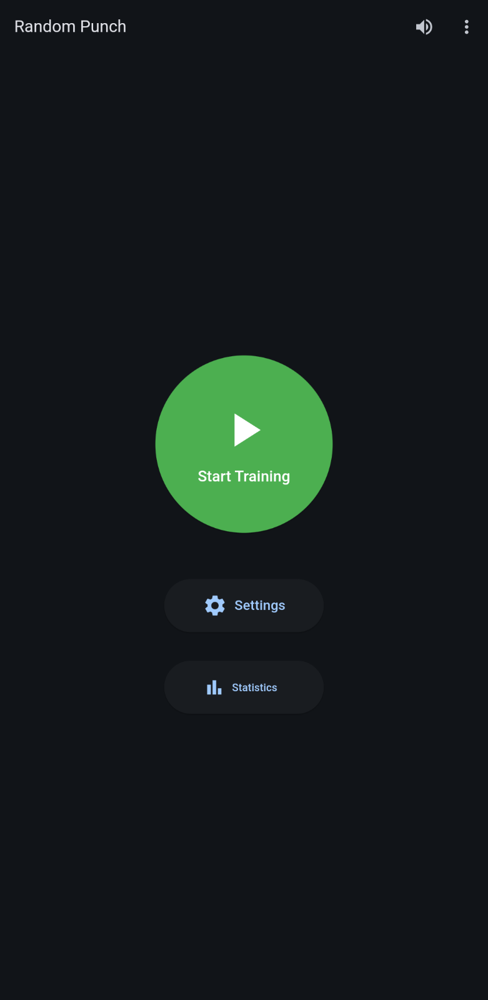
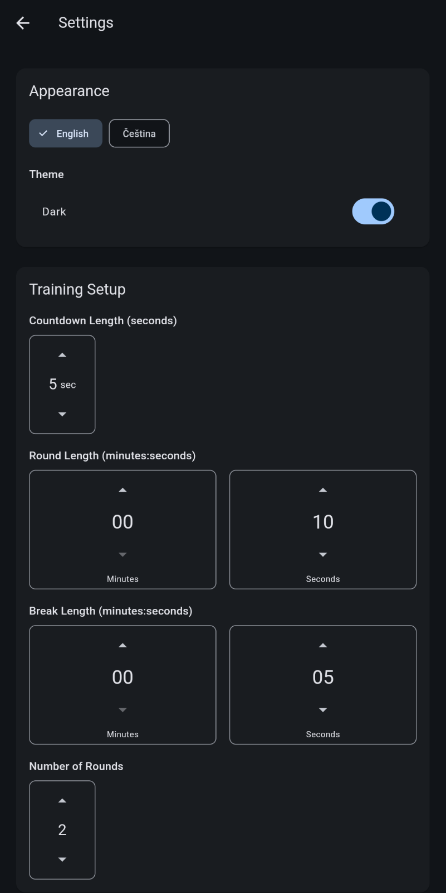
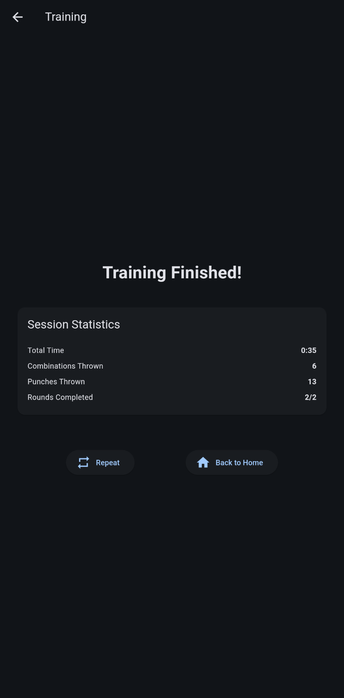
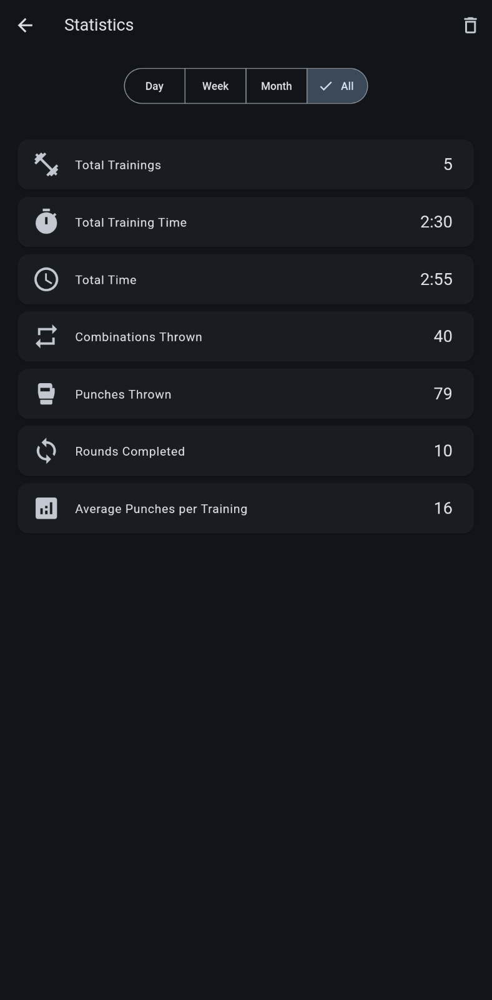

# Random Punch

[🇬🇧 English version](README.md)

Tréninková aplikace pro MMA/box, která pomáhá sportovcům cvičit techniky a kombinace pomocí náhodně zobrazovaných čísel.

## Instalace

### Android
1. Stáhněte si APK soubor z [nejnovější verze](https://github.com/sodomak/random-punch/releases/latest)
2. Na vašem Android zařízení klepněte na stažený APK soubor
3. Pokud budete vyzváni, povolte instalaci z neznámých zdrojů
4. Postupujte podle pokynů pro instalaci na Androidu
5. Po instalaci najdete "Random Punch" v seznamu aplikací

**Poznámka k bezpečnostním upozorněním:** Při instalaci se může zobrazit varování Google Play Protect s textem "Nebezpečná aplikace byla zablokována" nebo že "nezná vývojáře této aplikace". Toto je běžné pro aplikace instalované mimo Google Play Store a neznamená to problém s aplikací. Pro pokračování v instalaci:
1. Když se zobrazí varování, klepněte na "Další podrobnosti"
2. Zvolte "Přesto nainstalovat" pro pokračování v instalaci
3. Pokud budete dotázáni na odeslání aplikace ke kontrole, můžete zvolit libovolnou možnost - je to volitelné a neovlivní funkčnost aplikace

Alternativně můžete instalovat přes [Obtainium](https://github.com/ImranR98/Obtainium).

Poznámka: Aplikace je v současné době dostupná pouze pro Android.

## Rychlý průvodce

1. **Začít trénink**: Klikněte na tlačítko "Začít Trénink" na hlavní obrazovce
2. **Příprava**: Před začátkem tréninku proběhne odpočet
3. **Trénink**: Sledujte zobrazovaná čísla a provádějte odpovídající techniky
4. **Pauzy**: Odpočiňte si mezi koly, když je indikováno

## Nastavení

### Časová nastavení
- **Délka kola**: Nastavte délku každého tréninkového kola
- **Délka pauzy**: Nastavte délku odpočinku mezi koly
- **Délka odpočtu**: Nastavte délku úvodního odpočtu před tréninkem
- **Počet kol**: Nastavte, kolik kol chcete trénovat

### Nastavení čísel
- **Počet zobrazených čísel**: Vyberte mezi pevným počtem nebo náhodným rozsahem
  - **Pevný počet**: Vždy zobrazí stejný počet číslic
  - **Náhodný rozsah**: Zobrazuje proměnlivý počet číslic v nastaveném rozsahu
- **Interval mezi čísly**: Nastavte, jak rychle se objevují nová čísla
  - Nastavte minimální a maximální interval pro větší variabilitu

### Jazyk
- Přepínejte mezi češtinou a angličtinou pomocí výběru jazyka

### Statistiky
- Sledujte svůj tréninkový pokrok s detailními statistikami
- Zobrazení celkového času tréninku, přestávek a dokončených kol
- Sledování provedených kombinací a úderů
- Filtrování statistik podle dne, týdne, měsíce nebo celkové historie

### Zvukové funkce
- Hlasové oznámení čísel v češtině nebo angličtině
- Zvukové efekty pro tréninkové události (start, konec, pauzy)
- Možnost ztlumení zvuku pro tichý trénink

### Snímky obrazovky

    
    
    
    
    
    

## Licence
GNU General Public License v3.0 